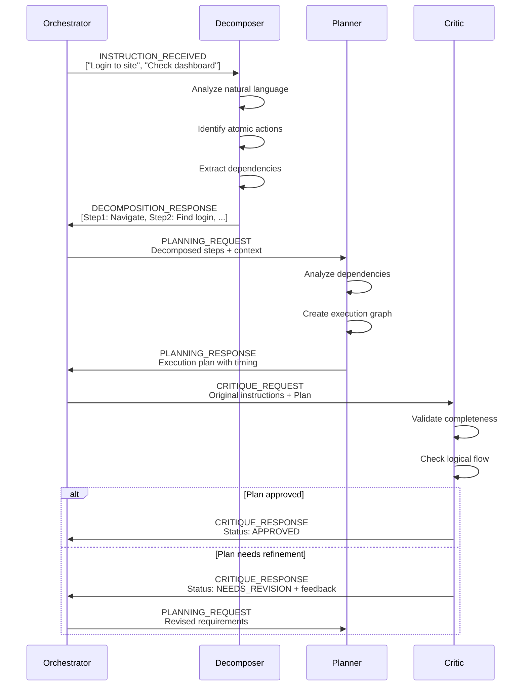
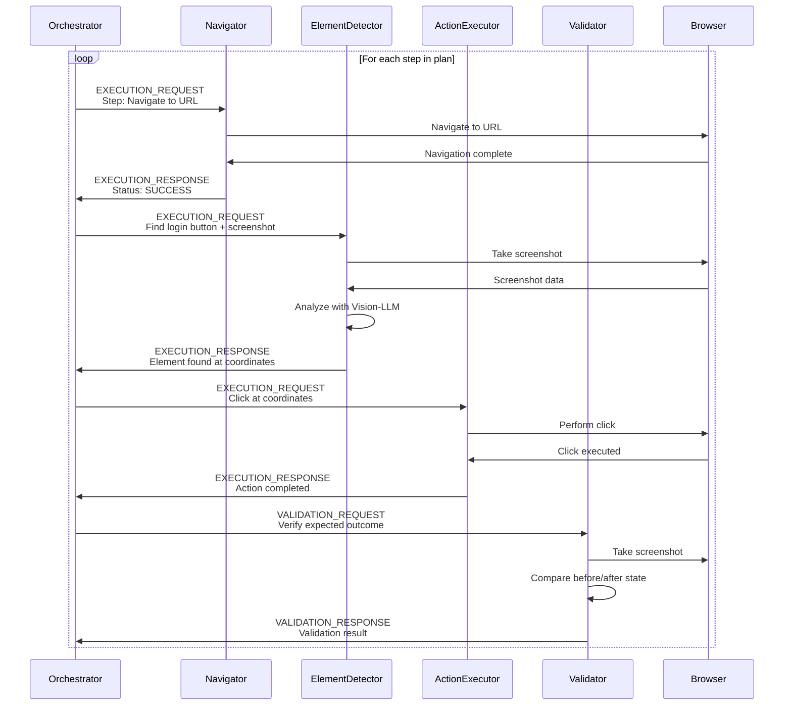
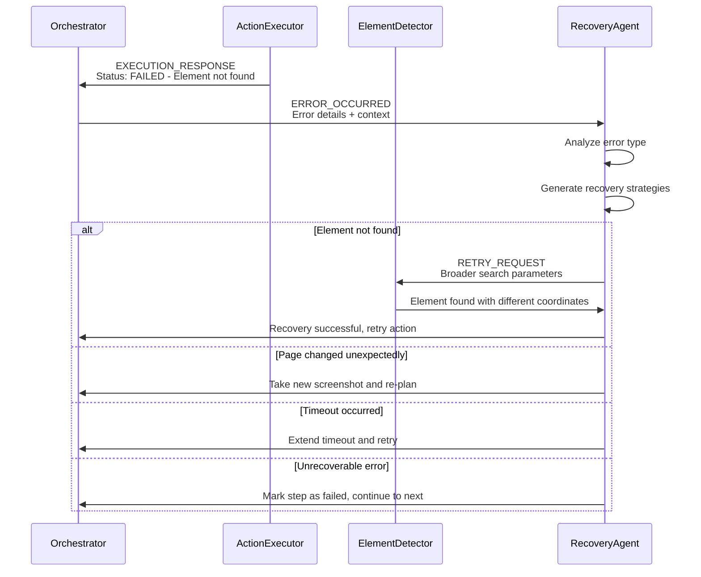

# QuantumQA - Agent Workflow Design

## Overview

This document details the sophisticated agent interaction patterns and workflows that power QuantumQA's intelligent testing capabilities. The framework employs multiple specialized agents that collaborate through structured communication protocols to transform natural language instructions into executed UI tests.

## Agent Communication Architecture

### Message Passing System

```python
@dataclass
class AgentMessage:
    id: str
    sender: str
    recipient: str
    message_type: MessageType
    payload: Dict[str, Any]
    timestamp: datetime
    parent_message_id: Optional[str] = None
    priority: Priority = Priority.NORMAL

class MessageType(Enum):
    INSTRUCTION_RECEIVED = "instruction_received"
    DECOMPOSITION_REQUEST = "decomposition_request" 
    DECOMPOSITION_RESPONSE = "decomposition_response"
    PLANNING_REQUEST = "planning_request"
    PLANNING_RESPONSE = "planning_response"
    CRITIQUE_REQUEST = "critique_request"
    CRITIQUE_RESPONSE = "critique_response"
    EXECUTION_REQUEST = "execution_request"
    EXECUTION_RESPONSE = "execution_response"
    VALIDATION_REQUEST = "validation_request"
    VALIDATION_RESPONSE = "validation_response"
    ERROR_OCCURRED = "error_occurred"
    RETRY_REQUEST = "retry_request"
```

### Agent Registry & Communication Hub

```python
class AgentCommunicationHub:
    def __init__(self):
        self.agents: Dict[str, Agent] = {}
        self.message_queue: asyncio.Queue = asyncio.Queue()
        self.message_history: List[AgentMessage] = []
        
    async def send_message(self, message: AgentMessage) -> None:
        """Send message between agents"""
        self.message_history.append(message)
        await self.message_queue.put(message)
        
    async def broadcast(self, message: AgentMessage, recipients: List[str]) -> None:
        """Broadcast message to multiple agents"""
        for recipient in recipients:
            msg = message.copy()
            msg.recipient = recipient
            await self.send_message(msg)
            
    def get_conversation_history(self, agent1: str, agent2: str) -> List[AgentMessage]:
        """Get message history between two agents"""
        return [msg for msg in self.message_history 
                if (msg.sender == agent1 and msg.recipient == agent2) or
                   (msg.sender == agent2 and msg.recipient == agent1)]
```

## Detailed Agent Workflows

### Phase 1: Instruction Analysis & Planning

#### 1.1 Orchestrator → Decomposer Workflow



#### 1.2 Decomposer Agent Logic

```python
class DecomposerAgent(Agent):
    def __init__(self, llm_client: LLMClient):
        super().__init__("decomposer")
        self.llm_client = llm_client
        
    async def process_instruction(self, instruction: str) -> List[AtomicStep]:
        """Break complex instruction into atomic steps"""
        
        prompt = f"""
        Decompose this UI testing instruction into atomic, executable steps:
        
        Instruction: "{instruction}"
        
        Break it down into:
        1. Navigation actions (go to URL)
        2. Element interaction actions (click, type, select)
        3. Verification actions (check text, verify element)
        4. Wait actions (wait for element, wait for page load)
        
        Return JSON array of steps with:
        - step_type: navigate|interact|verify|wait
        - action: specific action to perform
        - target: what to interact with
        - data: any input data needed
        - expected_outcome: what should happen
        """
        
        response = await self.llm_client.complete(prompt)
        return self._parse_decomposition_response(response)
    
    def _parse_decomposition_response(self, response: str) -> List[AtomicStep]:
        """Parse LLM response into structured steps"""
        steps_data = json.loads(response)
        return [AtomicStep(**step) for step in steps_data]
```

#### 1.3 Planner Agent Logic

```python
class PlannerAgent(Agent):
    def __init__(self):
        super().__init__("planner")
        
    async def create_execution_plan(
        self, 
        steps: List[AtomicStep],
        context: TestContext
    ) -> ExecutionPlan:
        """Create optimized execution plan with dependencies"""
        
        # Analyze step dependencies
        dependencies = self._analyze_dependencies(steps)
        
        # Determine parallel vs sequential execution
        execution_graph = self._build_execution_graph(steps, dependencies)
        
        # Add verification points
        verification_points = self._identify_verification_points(steps)
        
        # Estimate timing and costs
        timing_estimate = self._estimate_execution_time(steps)
        cost_estimate = self._estimate_llm_costs(steps)
        
        return ExecutionPlan(
            steps=steps,
            execution_graph=execution_graph,
            dependencies=dependencies,
            verification_points=verification_points,
            estimated_duration=timing_estimate,
            estimated_cost=cost_estimate
        )
    
    def _analyze_dependencies(self, steps: List[AtomicStep]) -> Dict[int, List[int]]:
        """Identify which steps depend on others"""
        dependencies = {}
        for i, step in enumerate(steps):
            deps = []
            
            # Navigation steps must complete before interaction
            if step.step_type == StepType.INTERACT:
                for j, prev_step in enumerate(steps[:i]):
                    if prev_step.step_type == StepType.NAVIGATE:
                        deps.append(j)
            
            # Verification depends on the action it's verifying
            if step.step_type == StepType.VERIFY:
                if i > 0:
                    deps.append(i - 1)  # Usually verifies previous action
                    
            dependencies[i] = deps
            
        return dependencies
```

#### 1.4 Critique Agent Logic

```python
class CriticAgent(Agent):
    def __init__(self, llm_client: LLMClient):
        super().__init__("critic")
        self.llm_client = llm_client
        
    async def validate_plan(
        self, 
        original_instructions: List[str],
        execution_plan: ExecutionPlan
    ) -> CritiqueResult:
        """Validate execution plan against original instructions"""
        
        # Convert plan back to natural language for comparison
        plan_description = self._plan_to_natural_language(execution_plan)
        
        critique_prompt = f"""
        Original instructions: {original_instructions}
        
        Generated execution plan: {plan_description}
        
        Analyze if the execution plan correctly implements the original instructions:
        
        1. Completeness: Are all required actions included?
        2. Correctness: Is the sequence logical?
        3. Efficiency: Are there unnecessary steps?
        4. Safety: Are there any risky actions?
        
        Respond with JSON:
        {{
            "approved": true/false,
            "issues": ["list of identified issues"],
            "suggestions": ["list of improvements"],
            "confidence": 0.0-1.0
        }}
        """
        
        response = await self.llm_client.complete(critique_prompt)
        critique_data = json.loads(response)
        
        return CritiqueResult(
            approved=critique_data["approved"],
            issues=critique_data["issues"],
            suggestions=critique_data["suggestions"],
            confidence=critique_data["confidence"]
        )
```

### Phase 2: Execution Workflow

#### 2.1 Execution Agent Coordination



#### 2.2 Element Detector Agent

```python
class ElementDetectorAgent(Agent):
    def __init__(self, vision_llm: VisionLLM, browser: BrowserManager):
        super().__init__("element_detector")
        self.vision_llm = vision_llm
        self.browser = browser
        
    async def find_element(
        self, 
        session_id: str, 
        element_description: str,
        context: PageContext
    ) -> ElementDetectionResult:
        """Find UI element using vision-LLM analysis"""
        
        # Capture current page screenshot
        screenshot = await self.browser.take_screenshot(session_id)
        
        # Prepare context for LLM
        vision_prompt = f"""
        Find the UI element: "{element_description}"
        
        Page context:
        - URL: {context.url}
        - Previous action: {context.last_action}
        
        Analyze this screenshot and locate the target element.
        Return JSON with:
        {{
            "found": true/false,
            "confidence": 0.0-1.0,
            "bounding_box": {{"x": 0, "y": 0, "width": 0, "height": 0}},
            "center_coordinates": {{"x": 0, "y": 0}},
            "element_type": "button|input|link|etc",
            "visible_text": "text if any",
            "attributes": {{"key": "value"}},
            "alternative_elements": [list of similar elements if found]
        }}
        """
        
        # Call vision LLM
        result = await self.vision_llm.analyze_image(screenshot, vision_prompt)
        
        return ElementDetectionResult.from_llm_response(result)
```

#### 2.3 Action Executor Agent

```python
class ActionExecutorAgent(Agent):
    def __init__(self, browser: BrowserManager):
        super().__init__("action_executor") 
        self.browser = browser
        
    async def execute_action(
        self,
        session_id: str,
        action: ActionRequest
    ) -> ActionResult:
        """Execute UI action with fallback strategies"""
        
        try:
            # Primary execution strategy
            result = await self._execute_primary_strategy(session_id, action)
            
            if result.success:
                return result
                
        except Exception as e:
            # Try fallback strategies
            result = await self._try_fallback_strategies(session_id, action, e)
            
        return result
    
    async def _execute_primary_strategy(
        self, 
        session_id: str, 
        action: ActionRequest
    ) -> ActionResult:
        """Execute action using primary strategy"""
        
        if action.action_type == ActionType.CLICK:
            return await self._execute_click(session_id, action)
        elif action.action_type == ActionType.TYPE:
            return await self._execute_type(session_id, action)
        elif action.action_type == ActionType.SCROLL:
            return await self._execute_scroll(session_id, action)
        else:
            raise ValueError(f"Unsupported action type: {action.action_type}")
    
    async def _execute_click(
        self, 
        session_id: str, 
        action: ActionRequest
    ) -> ActionResult:
        """Execute click action"""
        
        start_time = time.time()
        
        try:
            # Take screenshot before action for debugging
            before_screenshot = await self.browser.take_screenshot(session_id)
            
            # Perform click
            await self.browser.click(
                session_id=session_id,
                x=action.coordinates.x,
                y=action.coordinates.y,
                button="left",
                delay=100  # Small delay for natural interaction
            )
            
            # Wait for potential page changes
            await asyncio.sleep(0.5)
            
            # Take screenshot after action
            after_screenshot = await self.browser.take_screenshot(session_id)
            
            execution_time = time.time() - start_time
            
            return ActionResult(
                success=True,
                action_type=action.action_type,
                execution_time=execution_time,
                before_screenshot=before_screenshot,
                after_screenshot=after_screenshot,
                strategy_used="primary_click"
            )
            
        except Exception as e:
            return ActionResult(
                success=False,
                action_type=action.action_type,
                error_message=str(e),
                execution_time=time.time() - start_time
            )
```

### Phase 3: Validation & Error Recovery

#### 3.1 Validator Agent

```python
class ValidatorAgent(Agent):
    def __init__(self, vision_llm: VisionLLM):
        super().__init__("validator")
        self.vision_llm = vision_llm
        
    async def validate_outcome(
        self,
        action_result: ActionResult,
        expected_outcome: str,
        context: ValidationContext
    ) -> ValidationResult:
        """Validate that action produced expected outcome"""
        
        if not action_result.success:
            return ValidationResult(
                success=False,
                reason="Action failed to execute",
                confidence=1.0
            )
        
        # Compare before/after screenshots
        change_analysis = await self._analyze_visual_changes(
            action_result.before_screenshot,
            action_result.after_screenshot
        )
        
        # Use LLM to validate expected outcome
        validation_prompt = f"""
        Expected outcome: "{expected_outcome}"
        
        Visual changes detected: {change_analysis}
        
        Based on the visual changes, did the action achieve the expected outcome?
        
        Respond with JSON:
        {{
            "outcome_achieved": true/false,
            "confidence": 0.0-1.0,
            "observed_changes": ["list of changes"],
            "reason": "explanation"
        }}
        """
        
        result = await self.vision_llm.analyze_images(
            [action_result.after_screenshot],
            validation_prompt
        )
        
        validation_data = json.loads(result)
        
        return ValidationResult(
            success=validation_data["outcome_achieved"],
            confidence=validation_data["confidence"],
            observed_changes=validation_data["observed_changes"],
            reason=validation_data["reason"]
        )
```

#### 3.2 Error Recovery Workflow



## Agent State Management

### Session State Tracking

```python
@dataclass
class AgentSessionState:
    session_id: str
    current_step: int
    total_steps: int
    execution_plan: ExecutionPlan
    page_context: PageContext
    error_count: int
    retry_count: int
    start_time: datetime
    agent_states: Dict[str, Dict[str, Any]]
    
    def update_agent_state(self, agent_name: str, state_data: Dict[str, Any]):
        """Update individual agent's state"""
        self.agent_states[agent_name] = state_data
        
    def get_agent_state(self, agent_name: str) -> Dict[str, Any]:
        """Get individual agent's state"""
        return self.agent_states.get(agent_name, {})
```

### Cross-Agent Context Sharing

```python
class ContextManager:
    def __init__(self):
        self.shared_context: Dict[str, Any] = {}
        
    def update_context(self, key: str, value: Any, agent_name: str):
        """Update shared context from an agent"""
        self.shared_context[key] = {
            "value": value,
            "updated_by": agent_name,
            "timestamp": datetime.utcnow()
        }
    
    def get_context_for_agent(self, agent_name: str) -> Dict[str, Any]:
        """Get relevant context for specific agent"""
        # Filter context based on agent needs
        if agent_name == "element_detector":
            return {
                "current_url": self.shared_context.get("current_url"),
                "page_title": self.shared_context.get("page_title"),
                "last_action": self.shared_context.get("last_action")
            }
        # Add more agent-specific context filtering
        return self.shared_context
```

## Performance Optimization

### Agent Communication Optimization

```python
class OptimizedCommunicationHub(AgentCommunicationHub):
    def __init__(self):
        super().__init__()
        self.message_cache: Dict[str, AgentMessage] = {}
        
    async def send_message_with_cache(self, message: AgentMessage) -> None:
        """Cache frequently used messages"""
        cache_key = f"{message.sender}:{message.recipient}:{message.message_type}"
        
        # Cache response messages for similar requests
        if message.message_type in [MessageType.DECOMPOSITION_RESPONSE, 
                                   MessageType.PLANNING_RESPONSE]:
            self.message_cache[cache_key] = message
            
        await self.send_message(message)
    
    def get_cached_response(
        self, 
        sender: str, 
        recipient: str, 
        message_type: MessageType
    ) -> Optional[AgentMessage]:
        """Retrieve cached response if available"""
        cache_key = f"{sender}:{recipient}:{message_type}"
        return self.message_cache.get(cache_key)
```

## Testing & Debugging Agent Workflows

### Agent Interaction Tracing

```python
class AgentTracer:
    def __init__(self):
        self.traces: List[AgentTrace] = []
        
    def trace_message(self, message: AgentMessage, processing_time: float):
        """Record agent message for debugging"""
        trace = AgentTrace(
            message=message,
            processing_time=processing_time,
            timestamp=datetime.utcnow()
        )
        self.traces.append(trace)
    
    def generate_trace_report(self) -> str:
        """Generate human-readable trace report"""
        report = "Agent Interaction Trace:\n"
        for i, trace in enumerate(self.traces):
            report += f"{i+1}. {trace.message.sender} → {trace.message.recipient}\n"
            report += f"   Message: {trace.message.message_type}\n"
            report += f"   Time: {trace.processing_time:.3f}s\n\n"
        return report
```

This agent workflow design provides a sophisticated yet lightweight framework for coordinating multiple AI agents to perform complex UI testing tasks through natural language instructions.
