# QuantumQA - Lightweight Agentic Framework Architecture

## Overview

QuantumQA is a lightweight, agentic UI testing framework that runs locally without any database or persistent storage requirements. It uses multiple specialized AI agents working together to understand natural language instructions, plan test execution, and perform UI automation using vision-enabled LLMs.

## Core Principles

- **Lightweight & Portable**: Zero database, minimal dependencies, runs anywhere Python runs
- **Agentic Architecture**: Multiple specialized agents collaborate to execute tests
- **Vision-First Approach**: Uses computer vision to identify UI elements naturally
- **Natural Language Instructions**: Tests written in plain English
- **Self-Planning**: Agents automatically break down complex instructions into executable steps
- **Self-Validating**: Critique agents verify plans before execution
- **Immediate Results**: Returns structured test results without persistence

## Agentic System Architecture

### Multi-Agent Framework

```mermaid
graph TD
    subgraph "QuantumQA Agentic System"
        Orchestrator["🎭 Orchestrator Agent<br/>Entry point & coordination"]
        
        subgraph "Planning Phase"
            Decomposer["🔍 Decomposer Agent<br/>Break down instructions"]
            Planner["📋 Planner Agent<br/>Create execution flow"]
            Critic["🎯 Critique Agent<br/>Validate & refine plan"]
        end
        
        subgraph "Execution Phase"
            Navigator["🧭 Navigator Agent<br/>Page navigation"]
            ElementDetector["👁️ Element Detector Agent<br/>Find UI elements"]
            ActionExecutor["⚡ Action Executor Agent<br/>Perform interactions"]
            Validator["✅ Validator Agent<br/>Verify outcomes"]
        end
        
        subgraph "Support Services"
            VisionLLM["🔮 Vision-LLM Service"]
            BrowserMgr["🌐 Browser Manager"]
            ResultCollector["📊 Result Collector"]
        end
    end
    
    Orchestrator --> Decomposer
    Decomposer --> Planner
    Planner --> Critic
    Critic --> Navigator
    Navigator --> ElementDetector
    ElementDetector --> ActionExecutor
    ActionExecutor --> Validator
    Validator --> ResultCollector
    
    ElementDetector --> VisionLLM
    ActionExecutor --> BrowserMgr
    Navigator --> BrowserMgr
```



### 1. Agent Collaboration Workflow

**Phase 1: Planning & Analysis**
1. **Orchestrator Agent** receives natural language instructions
2. **Decomposer Agent** breaks instructions into atomic steps
3. **Planner Agent** creates execution flow with dependencies
4. **Critique Agent** validates plan against original instructions
5. Plan refinement loop until validation passes

**Phase 2: Execution**
1. **Navigator Agent** handles page navigation
2. **Element Detector Agent** locates UI elements using vision
3. **Action Executor Agent** performs UI interactions
4. **Validator Agent** verifies each step outcome
5. **Result Collector** aggregates execution data

### 2. Core Agent Specifications

#### 🎭 Orchestrator Agent
- **Purpose**: Entry point and coordination hub
- **Responsibilities**:
  - Initialize test session with browser
  - Coordinate agent interactions
  - Handle exceptions and recovery
  - Collect and return final results

#### 🔍 Decomposer Agent  
- **Purpose**: Break down complex instructions into atomic steps
- **Responsibilities**:
  - Parse natural language instructions
  - Identify individual actions (click, type, verify, etc.)
  - Determine data dependencies between steps
  - Output structured step list

#### 📋 Planner Agent
- **Purpose**: Create optimized execution flow
- **Responsibilities**:
  - Analyze step dependencies (sequential vs parallel)
  - Plan optimal execution order
  - Identify verification points
  - Create execution graph with retry strategies

#### 🎯 Critique Agent
- **Purpose**: Validate and refine execution plans
- **Responsibilities**:
  - Compare plan against original instructions
  - Identify missing steps or logic gaps
  - Suggest improvements and refinements
  - Approve plan or request changes

#### 🧭 Navigator Agent
- **Purpose**: Handle page navigation and routing
- **Responsibilities**:
  - Navigate to URLs
  - Handle page transitions
  - Detect page load completion
  - Manage browser state

#### 👁️ Element Detector Agent
- **Purpose**: Locate UI elements using vision-LLM
- **Responsibilities**:
  - Capture screenshots at decision points
  - Identify target elements using AI vision
  - Return precise coordinates and metadata
  - Handle element not found scenarios

#### ⚡ Action Executor Agent
- **Purpose**: Perform UI interactions
- **Responsibilities**:
  - Execute clicks, typing, scrolling
  - Handle form submissions
  - Manage file uploads/downloads
  - Wait for dynamic content

#### ✅ Validator Agent
- **Purpose**: Verify step outcomes and test assertions
- **Responsibilities**:
  - Validate expected outcomes
  - Compare before/after states
  - Verify data accuracy
  - Report success/failure status

## Technology Stack (Lightweight)

### Core Framework
```python
# Minimal dependencies
playwright==1.40.0          # Browser automation
openai==1.3.8               # Vision-LLM integration
anthropic==0.7.8            # Alternative LLM provider
pillow==10.1.0              # Image processing
pydantic==2.5.0             # Data validation
click==8.1.7                # CLI interface
rich==13.7.0                # Beautiful terminal output
```

### Optional Dependencies
```python
# Enhanced features (user choice)
opencv-python==4.8.1.78     # Advanced image processing
requests==2.31.0            # HTTP requests
python-dotenv==1.0.0        # Environment variables
```

### Installation
```bash
# Simple pip install
pip install quantumqa

# Or with optional features
pip install quantumqa[full]
```

## Framework Usage

### Basic Usage Pattern
```python
from quantumqa import QuantumQA

# Initialize framework
qa = QuantumQA(
    llm_provider="openai",  # or "anthropic"
    browser="chrome",       # chrome, firefox, safari
    headless=True          # or False for debugging
)

# Execute test with natural language
result = qa.run_test([
    "Navigate to https://example.com",
    "Click the login button",
    "Enter 'user@test.com' in email field", 
    "Enter 'password123' in password field",
    "Click submit button",
    "Verify dashboard page loads successfully"
])

# Get structured results
print(result.summary())        # High-level results
print(result.detailed_log())   # Step-by-step execution
result.save_artifacts("./test_artifacts/")  # Screenshots, etc.
```

### CLI Usage
```bash
# Run from command line
quantumqa run test_instructions.txt --browser chrome --save-artifacts

# Interactive mode
quantumqa interactive --url https://example.com

# Validate instructions without execution
quantumqa validate test_instructions.txt
```

## Data Structures (In-Memory Only)

### Test Execution Result
```python
@dataclass
class TestResult:
    test_id: str
    instructions: List[str]
    status: str  # success, failure, partial
    execution_time: float
    steps: List[StepResult]
    artifacts: List[Artifact]
    cost_estimate: float
    
    def summary(self) -> str: ...
    def detailed_log(self) -> str: ...
    def save_artifacts(self, path: str): ...
```

### Step Execution Result  
```python
@dataclass
class StepResult:
    step_number: int
    instruction: str
    agent_used: str
    status: str
    execution_time: float
    screenshot_path: Optional[str]
    error_message: Optional[str]
    retry_count: int
```

### Agent Communication Protocol
```python
@dataclass  
class AgentMessage:
    sender: str
    recipient: str
    message_type: str
    payload: Dict[str, Any]
    timestamp: datetime
```

## Agent Communication Flow


## Key Design Decisions

### Why Agentic Architecture?
- **Modularity**: Each agent has specific expertise
- **Reliability**: Agents can validate each other's work  
- **Flexibility**: Easy to add new capabilities
- **Debugging**: Clear agent responsibilities for troubleshooting

### Why No Database?
- **Simplicity**: No setup, no dependencies
- **Portability**: Runs anywhere Python runs
- **Speed**: No I/O overhead, pure in-memory processing
- **Transparency**: All data visible and exportable

### Why Minimal Dependencies?
- **Easy Installation**: Single pip install command
- **Compatibility**: Works across different environments
- **Maintenance**: Fewer dependencies to manage
- **Security**: Smaller attack surface

### Agent Communication Strategy
- **In-Process**: All agents run in same Python process
- **Message Passing**: Structured communication protocol
- **Async Support**: Non-blocking agent interactions
- **Error Propagation**: Graceful error handling across agents

## Framework Outputs

### Test Execution Report
```json
{
    "test_id": "login-flow-2024-01-15",
    "status": "success", 
    "execution_time": 45.2,
    "total_cost": 0.23,
    "steps_completed": 6,
    "steps_total": 6,
    "artifacts": [
        "./artifacts/step-1-navigate.png",
        "./artifacts/step-2-login-form.png",
        "./artifacts/final-dashboard.png"
    ],
    "agent_interactions": 24,
    "llm_api_calls": 8,
    "detailed_steps": [...],
    "performance_metrics": {...}
}
```

### Failure Analysis
```json
{
    "failure_point": "step_3_enter_credentials",
    "error_type": "element_not_found",
    "agent_analysis": "Email field selector changed from input[name='email'] pattern",
    "recovery_suggestions": [
        "Try alternative element detection",
        "Check if page loaded completely", 
        "Verify field is visible and enabled"
    ],
    "screenshot_path": "./artifacts/failure-point.png"
}
```

This lightweight, agentic architecture eliminates infrastructure complexity while providing sophisticated AI-powered testing capabilities that can run anywhere Python runs.
