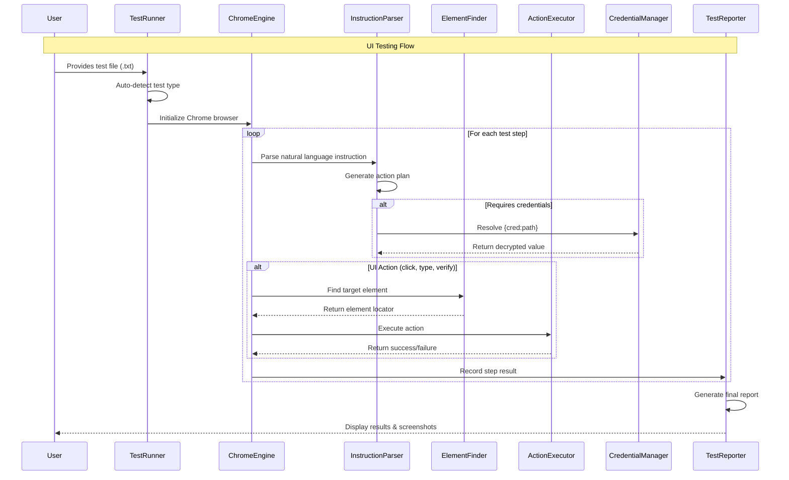

# QuantumQA Framework Architecture

## 🏗️ High-Level Architecture Overview

```mermaid
graph TB
    %% User Interface Layer
    User[👤 User] --> TestFiles[📝 Test Instructions<br/>UI/API Test Files]
    
    %% Entry Point
    TestFiles --> TestRunner[🚀 Test Runner<br/>run_quantum_test.py]
    
    %% Auto-Detection
    TestRunner --> Detection{🔍 Auto-Detection<br/>UI vs API Test?}
    
    %% UI Testing Path
    Detection -->|UI Test| UIEngine[🌐 Chrome Engine<br/>Browser Automation]
    Detection -->|API Test| APIEngine[🔌 API Engine<br/>HTTP Testing]
    
    %% UI Testing Components
    UIEngine --> InstructionParser[📋 Instruction Parser<br/>Natural Language → Actions]
    InstructionParser --> ElementFinder[🎯 Element Finder<br/>Smart UI Element Detection]
    ElementFinder --> ActionExecutor[⚡ Action Executor<br/>Click, Type, Verify, Upload]
    
    %% API Testing Components  
    APIEngine --> APIParser[📊 API Parser<br/>YAML/JSON → HTTP Requests]
    APIParser --> HTTPClient[🌐 HTTP Client<br/>Async Request Handler]
    HTTPClient --> ResponseValidator[✅ Response Validator<br/>Status & Field Validation]
    
    %% Shared Components
    UIEngine --> CredManager[🔐 Credential Manager<br/>Secure Config Storage]
    APIEngine --> CredManager
    
    %% Configuration
    InstructionParser --> ActionConfig[⚙️ Action Patterns<br/>YAML Config]
    ElementFinder --> SelectorConfig[🎯 Selector Strategies<br/>UI Element Rules]
    
    %% Output
    ActionExecutor --> UIReport[📊 UI Test Report<br/>Screenshots & Results]
    ResponseValidator --> APIReport[📈 API Test Report<br/>Performance & Validation]
    
    UIReport --> FinalReport[📋 Final Report<br/>Success Rate & Details]
    APIReport --> FinalReport
    
    %% Styling
    classDef userLayer fill:#e1f5fe
    classDef entryPoint fill:#f3e5f5  
    classDef uiPath fill:#e8f5e8
    classDef apiPath fill:#fff3e0
    classDef shared fill:#fce4ec
    classDef config fill:#f1f8e9
    classDef output fill:#e3f2fd
    
    class User,TestFiles userLayer
    class TestRunner,Detection entryPoint
    class UIEngine,InstructionParser,ElementFinder,ActionExecutor uiPath
    class APIEngine,APIParser,HTTPClient,ResponseValidator apiPath
    class CredManager shared
    class ActionConfig,SelectorConfig config  
    class UIReport,APIReport,FinalReport output
```

## 🔧 Component Architecture Details

```mermaid
graph TB
    subgraph "🎯 Core Testing Engines"
        ChromeEngine[🌐 Chrome Engine<br/>• Browser Management<br/>• Test Orchestration<br/>• Step Execution]
        
        APIEngine[🔌 API Engine<br/>• HTTP Test Execution<br/>• Multi-endpoint Support<br/>• Performance Tracking]
    end
    
    subgraph "📝 Parsing Layer"
        InstructionParser[📋 Instruction Parser<br/>• Natural Language Processing<br/>• Action Plan Generation<br/>• Context Awareness]
        
        APIParser[📊 API Parser<br/>• YAML/JSON Processing<br/>• Request Building<br/>• Validation Rules]
    end
    
    subgraph "🤖 Smart AI Components"
        ElementFinder[🎯 Element Finder<br/>• Multi-strategy Detection<br/>• UI Panel Recognition<br/>• Smart Fallbacks]
        
        ActionExecutor[⚡ Action Executor<br/>• Optimized Click Strategies<br/>• Form Interactions<br/>• File Upload<br/>• Verification Logic]
    end
    
    subgraph "🌐 Network Layer" 
        HTTPClient[🌐 HTTP Client<br/>• Async Requests<br/>• Auth Headers<br/>• Error Handling]
        
        ResponseValidator[✅ Response Validator<br/>• Status Code Check<br/>• Field Validation<br/>• Type Verification]
    end
    
    subgraph "🔐 Security & Config"
        CredentialManager[🔐 Credential Manager<br/>• AES Encryption<br/>• Masked Logging<br/>• Dynamic Resolution]
        
        ConfigSystem[⚙️ Configuration System<br/>• Action Patterns (YAML)<br/>• Selector Strategies<br/>• Environment Settings]
    end
    
    subgraph "📊 Reporting System"
        TestReporter[📋 Test Reporter<br/>• Success Rate Calculation<br/>• Screenshot Capture<br/>• Step-by-step Results<br/>• Performance Metrics]
    end
    
    %% Connections
    ChromeEngine --> InstructionParser
    ChromeEngine --> ElementFinder  
    ChromeEngine --> ActionExecutor
    ChromeEngine --> CredentialManager
    ChromeEngine --> TestReporter
    
    APIEngine --> APIParser
    APIEngine --> HTTPClient
    APIEngine --> ResponseValidator
    APIEngine --> CredentialManager
    APIEngine --> TestReporter
    
    InstructionParser --> ConfigSystem
    ElementFinder --> ConfigSystem
    HTTPClient --> ResponseValidator
    
    %% Styling
    classDef engine fill:#e8f5e8,stroke:#4caf50,stroke-width:2px
    classDef parser fill:#fff3e0,stroke:#ff9800,stroke-width:2px  
    classDef ai fill:#e3f2fd,stroke:#2196f3,stroke-width:2px
    classDef network fill:#f3e5f5,stroke:#9c27b0,stroke-width:2px
    classDef security fill:#fce4ec,stroke:#e91e63,stroke-width:2px
    classDef reporting fill:#e1f5fe,stroke:#00bcd4,stroke-width:2px
    
    class ChromeEngine,APIEngine engine
    class InstructionParser,APIParser parser
    class ElementFinder,ActionExecutor ai
    class HTTPClient,ResponseValidator network
    class CredentialManager,ConfigSystem security
    class TestReporter reporting
```

## 🔄 Data Flow Architecture



## 🏛️ Key Architectural Principles

### **1. 🔧 Modular Design**
- **Separation of Concerns**: Each component has a single responsibility
- **Loose Coupling**: Components communicate through well-defined interfaces
- **High Cohesion**: Related functionality grouped together

### **2. 🧠 AI-Driven Intelligence**
- **Smart Element Detection**: Multiple strategies for finding UI elements
- **Natural Language Processing**: Convert human instructions to executable actions
- **Context Awareness**: Understanding of application state and user intent

### **3. 🛡️ Security First**
- **Credential Encryption**: AES-256 encryption for sensitive data
- **Masked Logging**: Secure handling of passwords and API keys
- **Dynamic Resolution**: Runtime credential injection

### **4. 🚀 Performance Optimized**
- **Async Operations**: Non-blocking HTTP requests and browser actions
- **Smart Retry Logic**: Optimized click strategies to reduce failures
- **Parallel Processing**: Multiple operations when possible

### **5. 📊 Comprehensive Reporting**
- **Visual Documentation**: Screenshots for UI tests
- **Detailed Metrics**: Success rates, timing, performance data
- **Step-by-step Analysis**: Granular failure tracking

## 🌟 Framework Strengths

| Component | Key Innovation |
|-----------|----------------|
| **Test Runner** | Auto-detection of UI vs API tests |
| **Chrome Engine** | Smart click strategy optimization |
| **Element Finder** | Multi-strategy UI element detection |
| **Instruction Parser** | Natural language to action conversion |
| **Credential Manager** | Secure, encrypted credential storage |
| **API Engine** | Full HTTP testing with validation |
| **Reporting System** | Visual and metric-rich test results |

## 🔮 Extensibility Points

- **New Action Types**: Easy addition via YAML configuration
- **Custom Selectors**: Pluggable element finding strategies  
- **Additional Engines**: Support for mobile, desktop, or other protocols
- **Enhanced Validation**: Custom response validators
- **Reporting Formats**: Multiple output formats (JSON, HTML, PDF)

