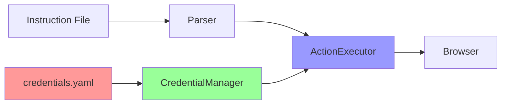

# 🔐 QuantumQA Security Guide

## Overview

QuantumQA implements enterprise-grade security features to protect sensitive information during automated testing. This guide covers credential management, encryption, and security best practices.

## 🎯 Security Features

### ✅ **Implemented Features**

- **Secure Credential Management** - No plain text passwords in test files
- **Runtime Credential Resolution** - Credentials resolved during execution only
- **Secure Logging** - Sensitive data never appears in logs or console output
- **File System Storage** - Simple, secure file-based credential storage
- **Optional Encryption** - Support for encrypting credential values
- **Automatic Detection** - Framework automatically detects and uses `credentials.yaml`
- **Multiple Formats** - Support for various credential reference formats

### 🔮 **Future Enhancements** 

- Database storage integration
- Azure Key Vault / AWS Secrets Manager integration
- Environment variable injection
- Two-factor authentication support

---

## 📋 Quick Start

### 1. Create Credentials File

Create `credentials.yaml` in your project root:

```yaml
# credentials.yaml
aihub:
  email: "your-email@company.com"
  password: "your-secure-password"

database:
  username: "db_user"
  password: "db_password"
  host: "localhost"
  port: 5432

api:
  key: "your-api-key"
  secret: "your-api-secret"
```

### 2. Update Instructions

Replace plain text with credential references:

```txt
# Before (INSECURE)
Type user@example.com in email field
Type mypassword123 in password field

# After (SECURE)
Type {cred:aihub.email} in email field
Type {cred:aihub.password} in password field
```

### 3. Run with Credentials

```bash
# Automatic detection (if credentials.yaml exists)
python run_generic_test.py examples/secure_test.txt --visible

# Explicit credential file
python run_generic_test.py examples/secure_test.txt --visible --creds credentials.yaml

# Custom credential file location
python run_generic_test.py examples/secure_test.txt --visible --credentials /path/to/secrets.yaml
```

---

## 🔑 Credential Reference Formats

### Supported Syntax

```txt
{cred:path.to.credential}      # Standard format
{credential:path.to.credential} # Explicit format  
{creds:path.to.credential}     # Short format
```

### Path Examples

```yaml
# credentials.yaml structure
app:
  login:
    email: "user@example.com"
    password: "secret123"
  database:
    host: "localhost"
    port: 5432

# Instruction references
Type {cred:app.login.email} in email field
Type {cred:app.login.password} in password field
Navigate to {cred:app.database.host}
```

---

## 🔒 Security Architecture

### Components

1. **CredentialManager** - Handles loading, decryption, and retrieval
2. **ActionExecutor** - Resolves credentials during text input
3. **ChromeEngine** - Initializes credential manager with file path
4. **Test Runner** - Handles command-line credential options

### Security Flow



### Data Flow

1. **Load Time**: Credentials loaded from file into memory
2. **Parse Time**: Instructions parsed, credential references identified  
3. **Execute Time**: Credentials resolved and injected during typing
4. **Log Time**: Only character counts logged, never actual values

---

## 🛡️ Security Best Practices

### File Security

```bash
# Set restrictive permissions
chmod 600 credentials.yaml

# Verify permissions
ls -la credentials.yaml
# Should show: -rw------- (owner read/write only)
```

### Git Security

Ensure credentials are NEVER committed:

```bash
# .gitignore (already configured)
credentials.yaml
credentials.yml
secrets.yaml
secrets.yml
.env
.env.local
encryption.key
```

### Environment Setup

```bash
# Production environment
export QUANTUMQA_ENCRYPTION_KEY="your-encryption-key"

# Development environment  
# Use unencrypted files with restricted permissions
```

---

## 🔐 Encryption Support

### Basic Usage (Unencrypted)

```yaml
# credentials.yaml - Development/Testing
aihub:
  email: "user@example.com"
  password: "plaintext-password"
```

### Advanced Usage (Encrypted)

```python
# Generate encryption key
from quantumqa.security import CredentialManager

key = CredentialManager.generate_encryption_key()
print(f"Encryption key: {key}")

# Encrypt values
manager = CredentialManager("credentials.yaml", key)
encrypted_password = manager.encrypt_credential("my-secret-password")
```

```yaml
# credentials.yaml - Production
aihub:
  email: "user@example.com"
  password: "encrypted:gAAAAABh..."  # Encrypted value
```

```bash
# Set environment variable
export QUANTUMQA_ENCRYPTION_KEY="your-base64-key"

# Run test
python run_generic_test.py test.txt --creds encrypted_credentials.yaml
```

---

## 📊 Security Verification

### Test Security Features

```bash
# Test credential resolution
python -c "
from pathlib import Path
from quantumqa.security import CredentialManager

# Load credentials
manager = CredentialManager(Path('credentials.yaml'))

# Test retrieval
email = manager.get_credential('aihub.email')
print(f'Email: {email}')

# List available credentials
print('Available credentials:')
for path, type_name in manager.list_available_credentials().items():
    print(f'  {path}: {type_name}')
"
```

### Verify Secure Logging

Run any test and verify logs show:
- ✅ `🔐 Credential resolved for secure input`
- ✅ `⌨️ Typing: '[CREDENTIAL:X chars]'`
- ❌ Never shows actual passwords or sensitive data

---

## 🚨 Security Warnings

### ⚠️ **CRITICAL - Never Do This:**

```txt
# DON'T commit credentials to version control
git add credentials.yaml  # ❌ DANGEROUS

# DON'T use plain text in production
Type password123 in password field  # ❌ INSECURE

# DON'T share credential files
email credentials.yaml to team  # ❌ UNSAFE
```

### ✅ **DO This Instead:**

```txt
# Use secure credential references
Type {cred:app.password} in password field  # ✅ SECURE

# Share credential file templates (without values)
# credentials.template.yaml with placeholder values

# Use environment variables for keys
export QUANTUMQA_ENCRYPTION_KEY="..."  # ✅ SECURE
```

---

## 🔧 Troubleshooting

### Common Issues

#### Credential Not Found
```
❌ Credential not found: aihub.email
```
**Solution**: Check credential path in YAML file

#### File Not Found
```
⚠️ Credentials file not found: credentials.yaml
```
**Solutions**:
- Create `credentials.yaml` in project root
- Use `--creds path/to/file.yaml` option
- Check file permissions (should be readable)

#### Permission Denied
```
❌ Error loading credentials: Permission denied
```
**Solution**: 
```bash
chmod 600 credentials.yaml
```

#### Encryption Failed
```
⚠️ Decryption failed, using plain text
```
**Solutions**:
- Verify `QUANTUMQA_ENCRYPTION_KEY` environment variable
- Check encrypted value format: `encrypted:base64data`
- Regenerate encryption key if corrupted

### Debug Mode

```bash
# Enable verbose credential logging
QUANTUMQA_DEBUG=true python run_generic_test.py test.txt --creds credentials.yaml
```

---

## 📚 API Reference

### CredentialManager Class

```python
from quantumqa.security import CredentialManager
from pathlib import Path

# Initialize
manager = CredentialManager(
    credentials_file=Path("credentials.yaml"),
    encryption_key="optional-key"
)

# Retrieve credential
value = manager.get_credential("app.login.password")

# List available credentials  
paths = manager.list_available_credentials()

# Generate encryption key
key = CredentialManager.generate_encryption_key()

# Encrypt value
encrypted = manager.encrypt_credential("secret-value")
```

### Utility Functions

```python
from quantumqa.security import resolve_credentials_in_text

# Resolve credentials in text
text = "Login with {cred:app.email} and {cred:app.password}"
resolved = resolve_credentials_in_text(text, credential_manager)
```

---

## 🎯 Security Compliance

### Industry Standards

- **OWASP**: Follows secure coding practices
- **NIST**: Implements credential management guidelines  
- **ISO 27001**: Supports information security management
- **SOC 2**: Enables security and compliance auditing

### Enterprise Features

- Audit logging (credential access events)
- Role-based access control (file permissions)
- Encryption at rest (optional)
- Separation of duties (credentials vs. test logic)

---

## 🚀 Advanced Configuration

### Multiple Credential Files

```bash
# Different environments
python run_generic_test.py test.txt --creds credentials.dev.yaml     # Development
python run_generic_test.py test.txt --creds credentials.staging.yaml # Staging  
python run_generic_test.py test.txt --creds credentials.prod.yaml    # Production
```

### Credential Hierarchies

```yaml
# credentials.yaml - Hierarchical structure
environments:
  dev:
    database:
      host: "dev-db.company.com"
      password: "dev-password"
  prod:
    database:
      host: "prod-db.company.com" 
      password: "encrypted:gAAAAABh..."

# Usage in instructions
Navigate to {cred:environments.dev.database.host}
Type {cred:environments.prod.database.password} in password field
```

### Integration Examples

```bash
# CI/CD Pipeline Integration
- name: Run Secure Tests
  run: |
    echo "$CREDENTIALS_YAML" > credentials.yaml
    chmod 600 credentials.yaml
    python run_generic_test.py test.txt --creds credentials.yaml
    rm credentials.yaml
  env:
    CREDENTIALS_YAML: ${{ secrets.TEST_CREDENTIALS }}
    QUANTUMQA_ENCRYPTION_KEY: ${{ secrets.ENCRYPTION_KEY }}
```

---

## 📞 Support

For security-related questions or issues:

1. Check this documentation first
2. Review troubleshooting section  
3. Test with simple credential file
4. Verify file permissions and paths
5. Check environment variables

Remember: **Security is everyone's responsibility!** 🔐
